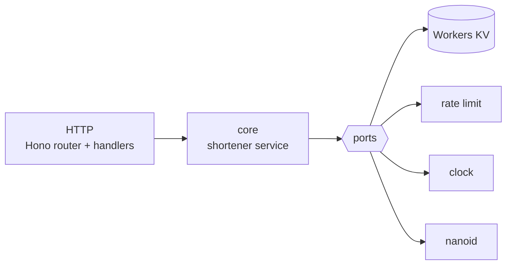

# nikednep

**API-only URL shortener on Cloudflare Workers.** `POST` a URL, get a short path back.
`GET` that path, get a `302` to the original. That is the whole product.

The name is `pendekin` backwards — Indonesian for "shorten it", in the casual register
you would use with a friend rather than the formal *perpendek*. Fittingly, `pendekin` →
`nikednep` is itself a short, opaque, reversible encoding of something meaningful, which
is exactly what a short code is.


|  |  |
| --- | --- |
| **Runtime** | Cloudflare Workers — TypeScript + Hono |
| **Storage** | Workers KV, and nothing else — no database, no schema, no migrations |
| **Cost** | Nothing. Everything used here sits inside Cloudflare's free tier |
| **Surface** | No UI, no login — the three endpoints below are all of it |

## Quick start

```bash
make install
make config      # copies wrangler.toml.example -> wrangler.toml
make dev         # http://localhost:8081
```

```bash
curl -s -X POST http://localhost:8081/api/shorten \
  -H 'content-type: application/json' \
  -d '{"url":"https://example.com","code":"nike","ttlSeconds":3600}'

curl -sI http://localhost:8081/nike
```

`wrangler dev` simulates KV on disk under `.wrangler/`, so nothing touches your account.
There is no migration step.

> [!NOTE]
> Local KV cannot reproduce the propagation delay or the concurrent-claim race described
> in [Consistency](#consistency) — both are properties of the real distributed store.
> Passing locally is not evidence they are absent.

## API

| Method | Path | Purpose |
| --- | --- | --- |
| `POST` | `/api/shorten` | create a short link |
| `GET` | `/:code` | `302` redirect to the stored URL |
| `GET` | `/health` | liveness check — `200` `{ "ok": true }` |

Rate limit: **20 creates per IP per minute**, via Cloudflare's rate limiting binding.

### Create a link

```http
POST /api/shorten
Content-Type: application/json

{ "url": "https://example.com/a/very/long/path", "code": "docs", "ttlSeconds": 86400 }
```

```http
201 Created

{
  "code": "docs",
  "shortUrl": "https://short.example/docs",
  "expireAt": "2026-09-21T09:00:00.000Z"
}
```

| Field | Required | Rules |
| --- | --- | --- |
| `url` | yes | absolute `http`/`https`, at most **8192** characters |
| `code` | no | 3–32 letters or digits. Omit it to get a 7-character nanoid. `api` and `health` are reserved |
| `ttlSeconds` | no | default **604800** (7 days), max **31536000** (1 year). Below 60 is accepted but effectively becomes 60 — see [Expiry](#expiry) |

### Errors

Every error responds with `{ "error": "<message>" }`.

| Status | When |
| --- | --- |
| `400` | `url`, `code`, or `ttlSeconds` failed validation, or the code is reserved |
| `404` | no link for that code — never created, or already expired |
| `409` | `code already exists` |
| `414` | `url` longer than 8192 characters |
| `429` | over the rate limit — `rate limited` |
| `503` | `could not store link, try again later` — the store refused the write |

## Architecture

Hexagonal (ports and adapters). `src/container.ts` is the composition root.



```text
src/
  index.ts                  Worker fetch entry
  container.ts              wires ports to adapters
  core/shortener/           entity, errors, ports, service
  adapter/kv/               LinkRepository over Workers KV
  adapter/ratelimit/        rate limiting binding, in-memory fallback
  adapter/clock/
  adapter/nanoid/
  app/http/                 router, handlers, JSON DTOs
wrangler.toml.example       template; copy to wrangler.toml and fill in the KV id
terraform/                  the KV namespace as code (optional; code stays on wrangler)
```

The repository port is two methods, `get` and `put`. Storage holds a link under its code
and hands it back; it decides nothing about validity.

> [!IMPORTANT]
> **The dependency rule:** `src/core` must not import `src/adapter`, `src/app`, Hono, or
> any Cloudflare binding type.

## Expiry

KV deletes keys on its own, and that is the whole mechanism. Nothing re-reads `expireAt`:
a link resolves for exactly as long as KV keeps its key, and 404s once KV drops it. There
is no sweep, no cron and no index — none of the cleanup a SQL store would need exists here.

The cost is that KV's limits become the link's limits.

> [!WARNING]
> **KV will not accept an expiry less than 60 seconds out.** A shorter TTL is rounded up
> and the link keeps working for the full minute, outliving the `expireAt` returned when
> it was created. `ttlSeconds: 2` reports a 2-second expiry and resolves for about 60.
> Treat 60 seconds as the real minimum.

Deletion is also not instant. Cloudflare only says a key "may take some time to be deleted
from various points of the network," and an already-read value can stay in an edge cache
for its `cacheTtl`. So a link can outlive its stated expiry by more than the rounding alone
explains.

In exchange, an expired code frees up on its own: once KV drops the key, that code reads as
available and can be claimed again.

## Consistency

KV is eventually consistent and has no atomic operations. That buys the simplicity above
and costs real guarantees, which are worth stating plainly.

> [!WARNING]
> **A newly created link may not resolve immediately.** KV caches the fact that a key was
> *absent* for up to 60 seconds. Creating a link with a custom code reads it first — that
> is how duplicates are rejected — and that read caches a miss for the key about to be
> written. So a custom-coded link can `404` briefly in the region that created it.

Generated codes avoid this entirely: they are **not** checked before writing, precisely so
that nothing caches a miss for them. The cost is that a collision overwrites instead of
retrying, which for a 7-character code over a 62-character alphabet is around one in a
hundred thousand at this corpus size — far better odds than a guaranteed 404 on every new
link.

> [!WARNING]
> **Concurrent claims on the same custom code resolve last-write-wins.** Two simultaneous
> requests for the same code can both succeed, and one link quietly replaces the other. KV
> cannot express a conditional write, so this is not fixable here.

**There is no way to delete a link before its TTL** through the API. Use:

```bash
npx wrangler kv key delete --binding LINKS <code>
```

## Deploy

Needs a free Cloudflare account. No credit card, no billing.

```bash
npx wrangler login
make create-resources     # creates the KV namespace
```

Paste the printed id into `wrangler.toml`, then:

```bash
make deploy
make health               # GET /health against production
make tail                 # stream production logs
```

Short links are live at `https://nikednep.<your-subdomain>.workers.dev/abc12xy`.

> [!TIP]
> Prefer the namespace as code? Provision it with Terraform instead — see [terraform/](terraform/).
> Deployment of the Worker itself stays on wrangler either way.

### Bindings

| Binding | Type | Purpose |
| --- | --- | --- |
| `LINKS` | KV | every link |
| `RATE_LIMITER` | rate limit | 20 creates/IP/minute; optional, falls back to per-isolate counting |

`wrangler.toml` is gitignored and nothing typechecks binding names against the code, so
`buildService` fails fast with a named error if `LINKS` is missing rather than throwing
from deep inside the adapter.

## Free tier

| Resource | Free allowance | Used for |
| --- | --- | --- |
| Workers | 100,000 requests/day | every request |
| KV | 100,000 reads/day, 1,000 writes/day, 1 GB | every link |
| Rate limiting | unmetered | 20 creates/IP/minute |

> [!IMPORTANT]
> **Writes are the binding limit: 1,000 per day.** Each new link is one write, so that is
> roughly the ceiling on links created per day. Reads are 100× more plentiful, which suits
> a shortener — written once, read many times. Exceeding the write limit returns `503`
> until the 00:00 UTC reset.

Nothing here can bill you: the Workers Free plan has no billing attached, so exceeding a
limit returns errors rather than charging overage.

Storage is bounded by `MAX_URL_LENGTH` rather than by a link count: 8 KB is the most one
link can cost, so a full 1 GB namespace is unreachable in practice.
